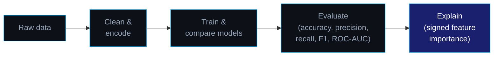

<p align="center">
  
</p>

<p align="center">
  
</p>

<p align="center">
  <a href="https://www.linkedin.com/in/nafay-abdullah-9095b8340"></a>
  <a href="https://github.com/MrNafay"></a>
</p>

<br/>

## 👋 About Me

I'm a Computer Science undergraduate at **Air University Islamabad**, deeply focused on mastering AI, LLMs, and prompt engineering to build intelligent, scalable workflow automations. My work bridges technical implementation with strategic impact — making systems work smarter, not just work.

I'm currently exploring cutting-edge AI tools, building practical solutions, and growing in public. Long-term, I'm committed to going deep in the AI ecosystem — from prompt design to full-stack automation.

```
        🎓  BSCS · Air University Islamabad · started 2024
        🔭  Currently exploring    →  AI, LLMs & prompt engineering fundamentals
        🌱  Building in public     →  interpretable ML projects, one at a time
        💡  Core interests         →  Generative AI, workflow automation, prompt design
        📍  Based in               →  Islamabad, Pakistan
```

<br/>

## 🧭 How I approach an ML project



A prediction alone isn't useful to a decision-maker — the "why" behind it is. That's the standard I hold every project to.

<br/>

## 🚀 Featured Project

<table>
  <tr>
    <td width="100%" valign="top">
      <h3>👥 Employee Attrition Prediction</h3>
      <p>End-to-end ML pipeline predicting which employees are at risk of leaving — and explaining exactly why. Trained and compared Logistic Regression, Decision Tree, and Random Forest; selected Logistic Regression for its balance of accuracy (86%) and full interpretability. Final output is a signed, ranked feature-importance chart an HR team can act on directly, not just a risk score.</p>
      <p>
        
        
        
        
      </p>
      <a href="https://github.com/MrNafay/employee-attrition-prediction"></a>
    </td>
  </tr>
</table>

<br/>

## 🛠️ Tech Stack


<br/>

## 📜 Certifications

<p align="center">
  
  <br/>
  
  <br/>
  
  <br/>
  
  <br/>
  
</p>

<br/>

## 📈 GitHub Stats

<p align="center">
  
  
</p>

<p align="center">
  
</p>

<p align="center">
  
</p>

<br/>

## 🧠 Right Now

```python
class NafayAbdullah:
    def __init__(self):
        self.role       = "CS Undergrad, AI & LLM Enthusiast"
        self.university = "Air University Islamabad (started 2024)"
        self.exploring  = ["AI fundamentals", "LLMs", "Prompt Engineering", "Workflow Automation"]
        self.certified  = ["Generative AI with LLMs", "Prompt Engineering for ChatGPT",
                            "Workflow Automation using Generative AI", "Introduction to AI"]
        self.believes   = "A model that explains its 'why' beats one that only scores well."

    def say_hi(self):
        print("Thanks for stopping by — check out the project above, or reach out below.")


me = NafayAbdullah()
me.say_hi()
```

<br/>

## 🤝 Let's Connect

<p align="center">
  <a href="https://www.linkedin.com/in/nafay-abdullah-9095b8340"></a>
</p>

<p align="center">
  <i>Growing in public, one project at a time. Let's connect if you're into intelligent systems and generative tech.</i>
</p>


