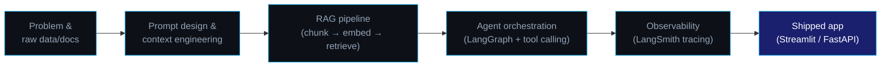

<p align="center">
  
</p>

<p align="center">
  
  &nbsp;
  
</p>

<p align="center">
  <a href="https://linkedin.com/in/nafayabdullah-9095b8340"></a>
  <a href="mailto:nafayabdullah321@gmail.com"></a>
  <a href="https://github.com/Abdullah1dev"></a>
</p>

<br/>

## 👋 About Me

I'm a **Computer Science undergraduate at Air University Islamabad**, specializing in **AI & Machine Learning**. I build end-to-end AI systems — RAG pipelines, LLM-powered assistants, and agentic workflows — using Python, LangChain, LangGraph, and both hosted and locally-run models.

I care about building AI tools that hold up outside a demo. Every project below was built from scratch, with real architecture decisions I can explain line by line — not a copy-pasted tutorial.

```
        🎓  BSCS · Air University Islamabad (AI/ML Specialization) · started 2024
        🔭  Currently building     →  Agentic AI systems with LangGraph + LangSmith
        🌱  Actively learning      →  LangGraph internals · LLM fine-tuning · Hugging Face Transformers
        💡  Core interests         →  RAG architecture · agent orchestration · LLM observability · prompt engineering
        📍  Based in               →  Islamabad, Pakistan
        🎯  Seeking                →  AI Engineer internship opportunities
```

<br/>

## 🧭 How I build an AI system



<br/>

## 🚀 Featured Projects

<table>
  <tr>
    <td width="50%" valign="top">
      <h3>🤖 Agentic AI Chatbot — LangGraph + RAG</h3>
      <p>Agentic chatbot that decides on its own when to answer directly vs. retrieve from uploaded PDFs. Tool calling, persistent memory via LangGraph Checkpointer, full LangSmith tracing.</p>
      <p>
        
        
        
      </p>
      <a href="https://github.com/Abdullah1dev/LLM-Chatbot"></a>
    </td>
    <td width="50%" valign="top">
      <h3>📄 AI PDF Assistant — RAG Q&A System</h3>
      <p>Answers natural-language questions over 100+ page PDFs via semantic retrieval. LangChain + FAISS, 500-token chunking, Streamlit UI, &lt;2s retrieval latency.</p>
      <p>
        
        
        
      </p>
      <a href="https://github.com/Abdullah1dev/ai-pdf-assistant-rag"></a>
    </td>
  </tr>
  <tr>
    <td width="50%" valign="top">
      <h3>📊 AI Data Analyst Assistant</h3>
      <p>Ingests CSVs (10,000+ rows), auto-generates statistical summaries, correlation heatmaps, and AI-written business insights, with a multi-turn Q&A chatbot on top.</p>
      <p>
        
        
        
      </p>
      <a href="https://github.com/Abdullah1dev/ai-data-analyst-assistant"></a>
    </td>
    <td width="50%" valign="top">
      <h3>🎯 AI-Powered ATS Resume Analyzer</h3>
      <p>Parses resumes against job descriptions, scores the match, flags missing skills, and suggests rewrites — structured prompting + JSON-parsed output.</p>
      <p>
        
        
        
      </p>
      <a href="https://github.com/Abdullah1dev/ai-ats-resume-analyzer"></a>
    </td>
  </tr>
</table>

<br/>

## 🛠️ Tech Stack

<details open>
<summary><b>AI / ML & LLM Tooling</b></summary><br/>


</details>

<details>
<summary><b>Data & ML Libraries</b></summary><br/>


</details>

<details>
<summary><b>Vector Databases & Search</b></summary><br/>


</details>

<details>
<summary><b>Web, APIs & Deployment</b></summary><br/>


</details>

<br/>

## 📜 Certifications

<p align="center">
  
  <br/>
  
  <br/>
  
  <br/>
  
  <br/>
  
</p>

<br/>

## 📈 GitHub Stats

<p align="center">
  
  
</p>

<p align="center">
  
</p>

<p align="center">
  
</p>

<p align="center">
  
</p>

<br/>

## 🧠 Currently Building

```python
class NafayAbdullah:
    def __init__(self):
        self.role       = "Aspiring AI Engineer"
        self.university = "Air University Islamabad — BSCS, AI/ML Specialization"
        self.currently  = ["LangGraph agentic systems", "LLM fine-tuning", "Hugging Face Transformers"]
        self.stack      = ["LangChain", "LangGraph", "LangSmith", "RAG", "FAISS", "Streamlit", "FastAPI"]
        self.certified  = ["Generative AI with LLMs", "Prompt Engineering for ChatGPT", "Workflow Automation w/ GenAI"]
        self.seeking    = "AI Engineer Internship — open to opportunities"

    def say_hi(self):
        print("Thanks for stopping by — take a look at the projects above, or reach out below.")


me = NafayAbdullah()
me.say_hi()
```

<br/>

## 🤝 Let's Connect

<p align="center">
  <a href="https://linkedin.com/in/nafayabdullah-9095b8340"></a>
  &nbsp;
  <a href="mailto:nafayabdullah321@gmail.com"></a>
</p>

<p align="center">
  <i>Open to AI/ML internship opportunities. If you're working on something interesting in the LLM or agentic AI space — let's talk.</i>
</p>


